<!-- markdownlint-disable-next-line -->
[English](./README.md) | 繁體中文

<!-- markdownlint-disable-next-line -->
<div align="center">

  <!-- markdownlint-disable-next-line -->
  # linkyee — 你自己的個人連結頁

  100% 免費、開源、可完全客製化的 LinkTree 替代方案 — 直接部署到 GitHub Pages。

  靈感來自 Jekyllrb 與 LinkTree。

  [](../../actions/workflows/build.yml) [](../../actions/workflows/pages/pages-build-deployment)

  [**線上 Demo →**](https://zhgchg.li/linkyee/)


</div>

> **一句話總結：** 點 *Use this template*、改一個 YAML 檔、push — 你的個人連結頁就活在 GitHub Pages 上、用免費的 `*.github.io` 網域（也可以綁自己的）。沒有 SaaS、沒有月費、沒有平台綁架。內建 AI 主題與 plugin 生成。

## 目錄

- [為什麼選 linkyee？](#為什麼選-linkyee)
- [設定檔](#設定檔)
- [主題 🎨](#主題-)
- [Plugins 🔌](#plugins-)
- [快速上手 — 部署到 GitHub Pages](#快速上手--部署到-github-pages)
- [本地測試](#本地測試)
- [自訂網域](#自訂網域-)
- [Showcase ✨](#showcase-)
- [贊助](#贊助)

---

## 為什麼選 linkyee？

- **100% 免費。** 跑在 GitHub Pages 上，沒有訂閱、沒有廣告、沒有付費升級。
- **100% 屬於你。** 設定、主題、plugin、內容全部在自己的 GitHub repo，想下架就下架。
- **8 個內建主題** — 改 `config.yml` 一行就能切換。
- **AI Style Designer。** 用自然語言描述你想要的風格，內建的 [`linkyee-style-designer`](./.claude/skills/linkyee-style-designer/SKILL.md) Claude skill 會幫你寫整套主題（HTML + CSS + JS）。
- **6 個內建 plugin** 抓即時資料 — GitHub stars、最後 commit、profile 統計、RSS/Atom feed、日期倒數、最新 YouTube 影片。
- **AI Plugin Builder。** 想抓其他來源的資料？描述一下，內建的 [`linkyee-plugin-builder`](./.claude/skills/linkyee-plugin-builder/SKILL.md) skill 會幫你寫好 Ruby plugin 並接上去。
- **內建 SEO 與無障礙。** 符合 WCAG AA 對比、深色模式、響應式 RWD（最低 320 px）、OG/Twitter meta、鍵盤可達 focus。
- **本地預覽 + 自動 rebuild。** `./preview.sh` 一存檔就重新 build；瀏覽器重整即可，不用裝任何套件。

### 請我喝杯啤酒 ❤️❤️❤️

[](https://www.paypal.com/ncp/payment/CMALMPT8UUTY2)

[**如果這個專案幫到你，歡迎請我喝杯咖啡，謝謝。**](https://www.paypal.com/ncp/payment/CMALMPT8UUTY2)

歡迎開 issue 或送 PR 修正/貢獻。:)

---

## 設定檔

頁面上會出現的所有東西，都由一個檔案驅動：[`config.yml`](./config.yml)。它是用 Liquid 渲染的 YAML，分五個頂層區塊：

```yaml
theme: default                     # ← ./themes/ 底下的目錄名
lang: "en"

plugins:                           # ← 選用，build 時抓的動態資料
  - GithubRepoStarsCountPlugin: [ZhgChgLi/linkyee]

title: "Your Name"                 # ← 個人檔案 header
avatar: "./images/profile.jpeg"
name: "@yourhandle"
tagline: "One line about you."

links:                             # ← 連結列表的按鈕
  - link:
      icon: "fa-brands fa-github"
      text: "GitHub ({{ vars.GithubRepoStarsCountPlugin['ZhgChgLi/linkyee'] }} ⭐)"
      url: "https://github.com/yourname"
      target: "_blank"

socials: [ ... ]                   # ← 純 icon 的社群連結列
footer: "Free-form HTML."
copyright: "© 2026 You."
```

repo 內附的 [`config.yml`](./config.yml) 是一個跑得起來的完整範例，**每個內建 plugin 都用到了** — 把它當成正式參考文件。直接改欄位、push、等 GitHub Actions 重新 build 完、瀏覽器重整就好。

### 自動重新部署

網站每天會自動重新 build 一次，讓 plugin 的輸出（star 數、最新文章…）保持最新。cron 設定寫在 [`build.yml`](../../actions/workflows/build.yml)：

```yaml
schedule:
    - cron: '0 0 * * *'   # 每天 UTC 00:00
```

不需要排程重 build 的話，把 `schedule:` 區塊刪掉即可。

---

## 主題 🎨

linkyee 內建 **8 個主題**，全部都可以直接套用。改 `config.yml` 一行就能切：

```yaml
theme: minimal-mono   # 任何 ./themes/ 底下的目錄名
```

| Slug | 淺色 | 深色 | 風格 / 適合誰 |
|---|---|---|---|
| `default` | 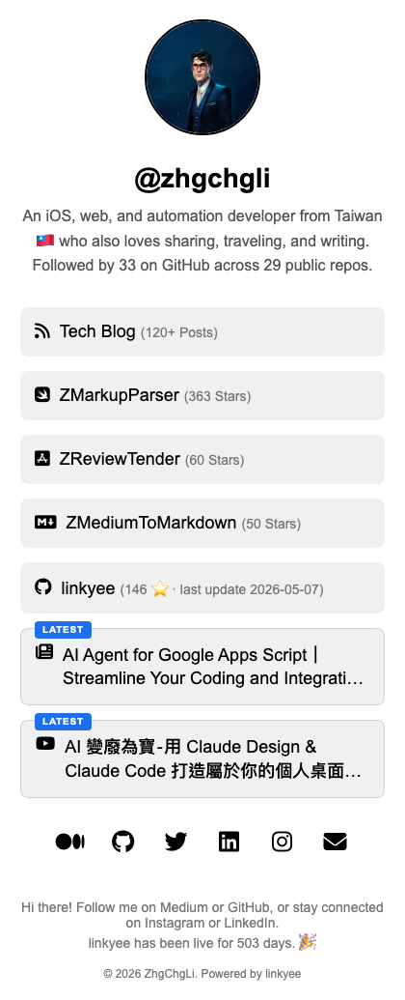 | 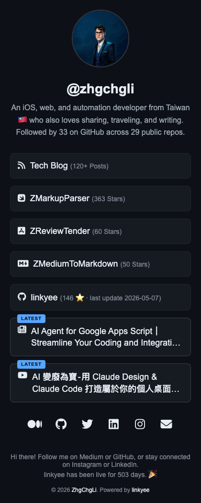 | 乾淨卡片風 · 安全的預設值 |
| `minimal-mono` | 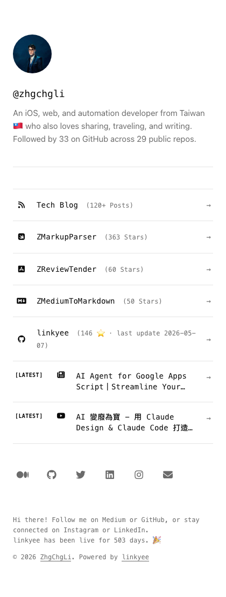 | 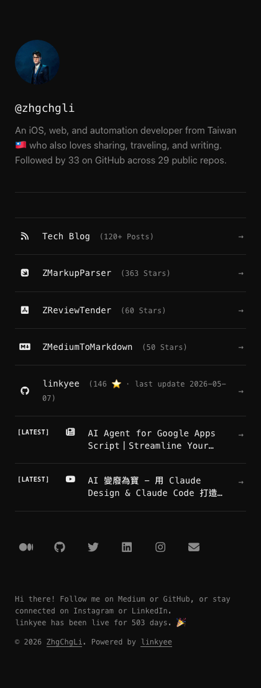 | 瑞士極簡 · 等寬字 · 工程師、寫作者 |
| `editorial-serif` | 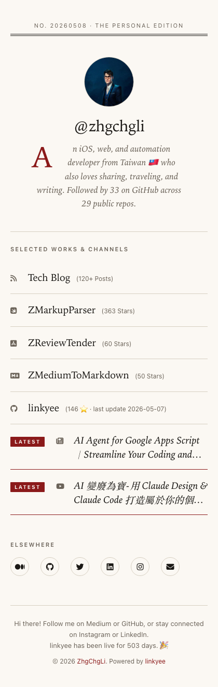 | 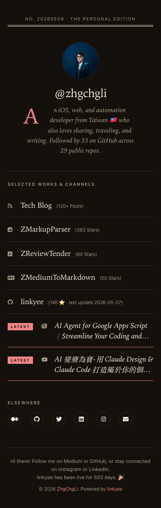 | 雜誌襯線體 · drop cap · 部落客、記者 |
| `neo-brutalism` | 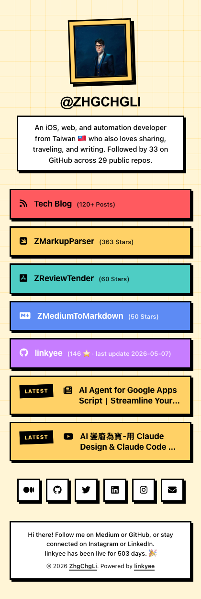 | 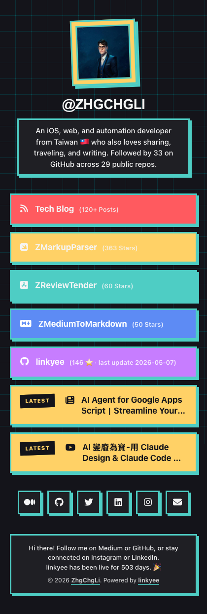 | 粗框線 · 原色 · 獨立開發者、藝術家 |
| `glassmorphism` | 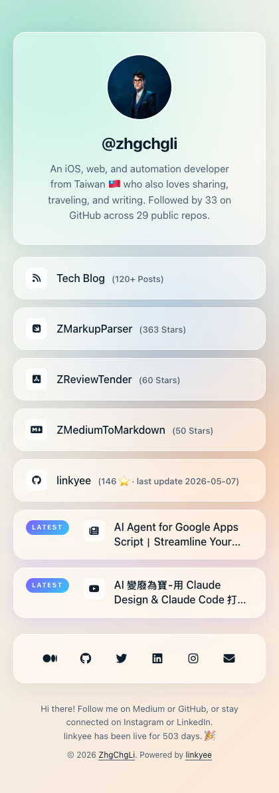 | 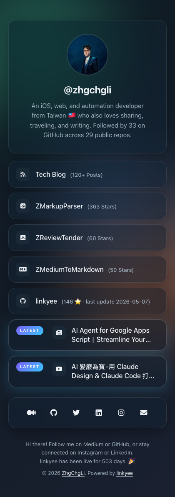 | 毛玻璃卡片 · 設計師、設計工作室 |
| `paper-card` | 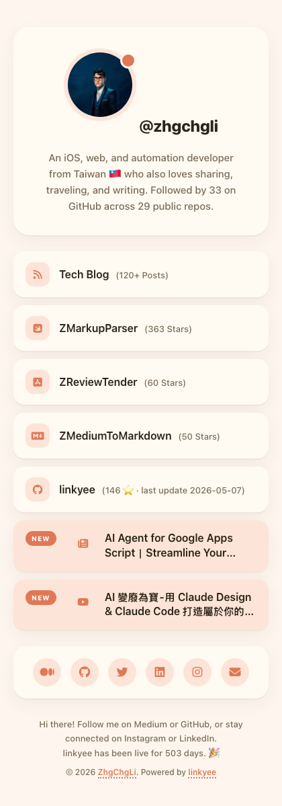 | 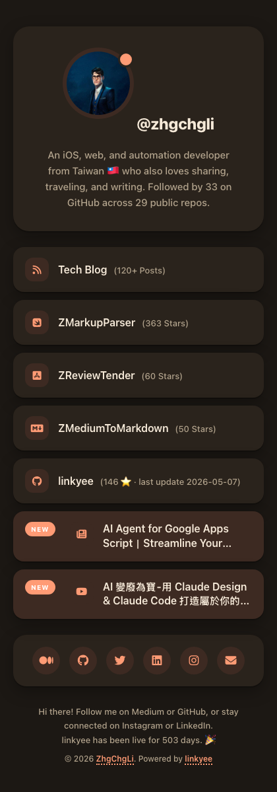 | 粉彩卡片 · 圓角 · 創作者、插畫家 |
| `newsprint` | 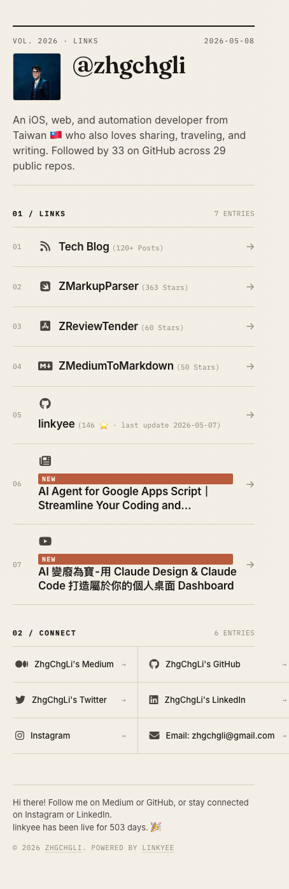 | 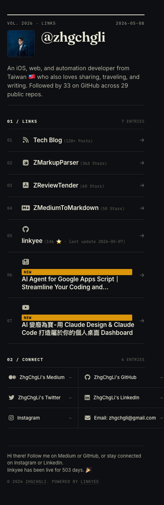 | 報紙刊頭 · 襯線 + 等寬 · 編號連結列 · [link.zhgchg.li](https://link.zhgchg.li/) 線上版採用此主題 |
| `terminal-retro` | 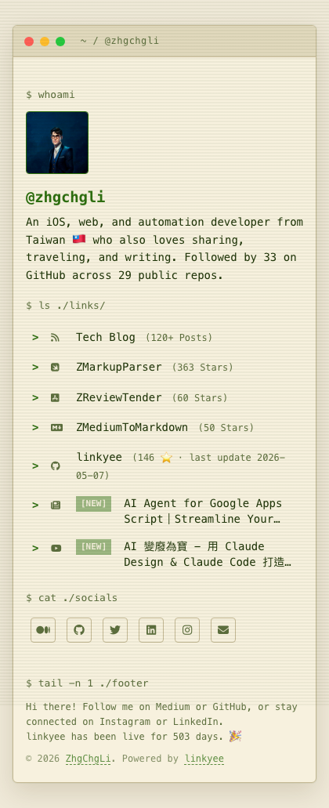 | 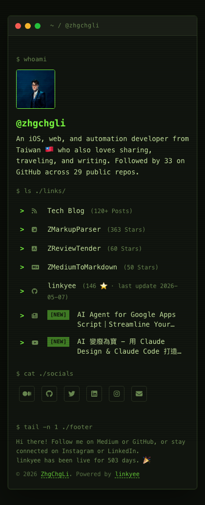 | CRT · 掃描線 · 黑底螢光綠（深色）/ 米色印表紙橄欖綠（淺色）· hacker 風 |

每個內建主題都符合相同的基準：WCAG AA 對比、**深色模式跟著系統外觀自動切換**（沒有手動 toggle）、響應式到 320 px、鍵盤可達 focus、支援 `prefers-reduced-motion`。

要在 commit 前先試試看，看 [本地測試](#本地測試)。要重新產上面那些預覽截圖，跑 `./scripts/screenshot-themes.sh`（需要 `npx playwright`）。

### 手動改主題

每個主題放在 `./themes/<theme-name>/`，三個檔案：

- `index.html` — Liquid 模板（會吃 `config.yml`）
- `styles.css` — 樣式
- `scripts.js` — 可以是空的，但檔案要存在

`default` 主題自帶 Font Awesome 在 `themes/default/fontawesome/` 底下。其他內建主題從 CDN 載 Font Awesome，讓主題目錄保持輕量。

### 🤖 AI Style Designer — 用文字描述產生主題

找不到喜歡的風格？用自然語言描述就好，內建的 [`linkyee-style-designer`](./.claude/skills/linkyee-style-designer/SKILL.md) Claude skill 會幫你產出完整的主題。

**怎麼用：**

1. 安裝 [Claude Code](https://docs.claude.com/en/docs/claude-code/overview)，用它打開這個 repo。
2. 用自然語言描述。例如：

   > *「設計一個靈感來自 1960 年代 Penguin 平裝書封的 linkyee 主題。」*
   >
   > *「我想要連結頁看起來像日本旅館的網站 — 安靜、優雅、大量留白。」*
   >
   > *「我要 vaporwave 風格，但要保持無障礙。」*
3. Skill 會讀你的 `config.yml`、必要時問你細節、產出 `themes/<your-theme>/`、把 `config.yml` 的 `theme:` 切過去、跑一次 build。
4. 跑 `./preview.sh <new-theme>` 在本地看結果。

Skill 套用跟內建主題一樣的品質標準：拒絕 AI slop（不亂用紫粉漸層、不拿 emoji 當 icon、不全部置中沒有層次）、要有真正的字級層次、無障礙最低標、**嚴格 RWD** — mobile-first、≥44 px 點擊區域、320 px 不能橫向 scroll。

**進階設計工具。** 想要更完整的設計師體驗（多方向探索、專家評審、動畫輸出），可以另外裝上游的 [`huashu-design`](https://github.com/alchaincyf/huashu-design) skill。兩個都裝的話，linkyee skill 會把任務轉給 `huashu-design`。

---

## Plugins 🔌

Plugin 是小型的 Ruby class，**在 build 時**抓資料注入到頁面上。可以拿來在任何連結、tagline、footer — 任何 Liquid 字串內顯示即時數值。

### 內建 plugin

| Plugin | 輸出什麼 | 引用方式 |
|---|---|---|
| `GithubRepoStarsCountPlugin` | 一或多個 repo 的 star 數 | `{{ vars.GithubRepoStarsCountPlugin['owner/repo'] }}` |
| `GithubLastCommitPlugin` | 最新 commit 的 `sha` / `date` / `message` | `{{ vars.GithubLastCommitPlugin['owner/repo'].date }}` |
| `GithubProfilePlugin` | `followers` / `following` / `repos` | `{{ vars.GithubProfilePlugin['user'].followers }}` |
| `RSSFeedPlugin` | 最新項目（Medium / 部落格 / podcast / YouTube feed） | `{{ vars.RSSFeedPlugin['url'][0].title }}` |
| `CountdownPlugin` | 距離某日期還剩 / 已過幾天 | `{{ vars.CountdownPlugin.label.days }}` |
| `YouTubeChannelLatestVideoPlugin` | 最新影片 — 標題、URL、縮圖 | `{{ vars.YouTubeChannelLatestVideoPlugin['@handle'].title }}` |

在 `config.yml` 啟用：

```yaml
plugins:
  - GithubRepoStarsCountPlugin:
      - ZhgChgLi/linkyee
  - RSSFeedPlugin:
      - https://yourblog.example/feed.xml
```

…然後在任何會渲染 Liquid 字串的地方引用：

```yaml
links:
  - link:
      icon: "fa-brands fa-github"
      text: "linkyee ({{ vars.GithubRepoStarsCountPlugin['ZhgChgLi/linkyee'] }} ⭐)"
      url: "https://github.com/ZhgChgLi/linkyee"
```

如果某個 plugin 在 build 時失敗（網路問題、API 改版、token 過期…），build 還是會成功 — 該值會渲染成空字串，錯誤會印在 GitHub Actions 的 log。網站不會因為某個外部 API 不穩就壞掉。

### 🤖 AI Plugin Builder — 用文字描述產生 plugin

需要 linkyee 沒有內建的資料源？用 [Claude Code](https://docs.claude.com/en/docs/claude-code/overview) 打開 repo、描述你要的東西。內建的 [`linkyee-plugin-builder`](./.claude/skills/linkyee-plugin-builder/SKILL.md) skill 知道 plugin 的合約。

**例子：**

> *「加一個 plugin，把 medium.com/@myhandle 最新的 3 篇文章變成新的連結。」*
>
> *「從 wttr.in 抓台北目前的天氣，把氣溫顯示在 footer。」*
>
> *「加一個 plugin，用 Steam Web API 撈我的 Steam 總遊玩時數。」*

Skill 會：

1. 跟你確認資料來源與資料結構。
2. 產出 `plugins/<YourPlugin>.rb`（用 base class 提供的 HTTP/JSON/cache helper，不用自己寫 `Net::HTTP`）。
3. 把它接到 `config.yml` 的 `plugins:` 區塊，並在你指定的位置引用輸出。
4. 跑 `bundle exec ruby ./scaffold.rb`，驗證值有確實渲染到 `_output/index.html`。

### Developer wiki

完整的 plugin 合約 — base class helper、常見 pattern（HTTP、JSON、scrape、cache）、Liquid 渲染規則、debug 技巧 — 看 **[`plugins/README.md`](./plugins/README.md)**。這份就是 AI skill 在產 plugin 時讀的正式參考。

---

## 快速上手 — 部署到 GitHub Pages
### 關於 GitHub Pages
> GitHub Pages 是 GitHub 提供的免費 hosting 服務，可以直接從 GitHub repo 建立並發布網站。任何擁有 GitHub 帳號的開發者、設計師都可以拿來架個人、專案、組織網站，不需要外部 hosting。GitHub Pages 與 GitHub repo 無縫整合，每次推新內容都會自動產出靜態網站。

#### Step 1. 點 [linkyee](https://github.com/ZhgChgLi/linkyee) 模板 repo 右上角的「Use this template」 → 「Create a new repository」：


#### Step 2. 勾選「Include all branches」、輸入想要的 GitHub Pages repo 名稱，按「Create repository」：


> GitHub Pages 的 repo 名稱會影響網址。輸入 `your-username.github.io` 當 Repo Name，那就是你 GitHub Pages 站台的網址。
> 如果你已經有 `your-username.github.io` 這個 repo，那你的 GitHub Pages 網址會是 `your-username.github.io/Repo-Name`。

#### 等 fork 完成。第一次設定可能會遇到 deployment 失敗，因為 forked repo 的權限問題。接下來步驟會修。


#### Step 4. 進 Settings → Actions → General，確認以下選項都選了：


- Actions permissions：`Allow all actions and reusable workflows`
- Workflow permissions：`Read and write permissions`

選完按 Save。

#### Step 5. 進 Settings → Pages，確認 GitHub Pages 的來源 branch 設成「gh-pages」：


> 上方的訊息 `Your site is live at: XXXX` 就是你公開的 GitHub Pages 網址。

#### Step 6. 進 Settings → Actions，等第一次部署跑完：


#### Step 7. 打開 GitHub Pages 網址確認 fork 成功：


> 恭喜！部署成功，你可以開始改設定檔放上自己的資料了。🎉🎉🎉

#### 注意每次改檔案後，都要等 GitHub Actions 跑完 `Automatic build` 與 `pages build and deployment`。


跑完重新整理頁面就會看到變更。🚀

---

## 本地測試

把網站 build 起來、跑在 `http://localhost:8080`：

```bash
./preview.sh                    # 用 config.yml 目前設定的主題 build
./preview.sh minimal-mono       # 暫時切到 <theme-name>、build、serve；
                                # Ctrl-C 時還原 config.yml
PORT=4000 ./preview.sh          # 換 port
```

帶主題參數時，`preview.sh` 會先備份 `config.yml`、切到指定主題跑這次 session、`Ctrl-C` 時還原原本的設定 — 你 commit 進去的設定不會被改到。

### 存檔自動 rebuild

預覽跑著時，`preview.sh` 會 watch：

- `themes/`
- `plugins/`
- `config.yml`
- `scaffold.rb`

任何變動會立刻觸發 rebuild — 重新整理瀏覽器就好。裝 [`fswatch`](https://github.com/emcrisostomo/fswatch)（macOS 上 `brew install fswatch`）可以做到秒級反應；沒裝的話會 fallback 到 1 秒輪詢，不需要任何額外相依。

build 失敗時（例如 Liquid 引用錯了），watcher 會印錯誤訊息但繼續跑 — 修好、再存檔，下次存檔就會重 build。

### 需求

- Ruby（一次性 `bundle install` 抓 `liquid` 與 `nokogiri`）
- Python 3（或 Ruby）給 `preview.sh` 起的靜態檔案 server

---

## 自訂網域 ❤️❤️❤️

可以幫 GitHub Pages 設自訂網域，像我自己的：[https://link.zhgchg.li](https://link.zhgchg.li)。

跟著 [我的綁定教學](https://en.zhgchg.li/posts/zrealm-dev/github-pages-custom-domain-setup-replace-github-io-with-your-own-domain-483af5d93297) 做。如果想買網域，歡迎透過 [我的 Namecheap 推薦連結購買](https://namecheap.pxf.io/P0jdZQ) — 我會收到一點點分潤，能幫助我繼續貢獻開源。

---

## Showcase ✨

用 **linkyee** 做出來的真實網站 — 快速、乾淨、開源。

> 用 linkyee 做了自己的站？  
> ⭐ 開個 PR 把它加在這裡，啟發其他人！

| 預覽 | 網站 | 描述 |
|--------|--------|-------------|
|  | [link.zhgchg.li](https://link.zhgchg.li) | ZhgChgLi (Harry Li) 的個人部落格連結頁 |
| - | 你的站 | 你的站可以放在這裡 🚀 |

---

## 贊助

[](https://www.paypal.com/ncp/payment/CMALMPT8UUTY2)

## 關於
- [ZhgChg.Li](https://zhgchg.li/)
- [ZhgChgLi's Medium](https://blog.zhgchg.li/)

## 其他作品
### Swift 套件
- [ZMarkupParser](https://github.com/ZhgChgLi/ZMarkupParser) 是一個純 Swift 套件，幫你把 HTML 字串轉成可客製樣式與 tag 的 NSAttributedString。
- [ZPlayerCacher](https://github.com/ZhgChgLi/ZPlayerCacher) 是 AVAssetResourceLoaderDelegate 協定的輕量實作，讓 AVPlayerItem 支援串流檔案的 cache。

### 整合工具
- [XCFolder](https://github.com/ZhgChgLi/XCFolder) 是強大的 CLI 工具，把 Xcode 虛擬 group 轉成實際資料夾，重組專案結構與 Xcode group 對齊，方便接 Tuist、XcodeGen 等現代專案產生工具。
- [ZReviewTender](https://github.com/ZhgChgLi/ZReviewTender) 從 App Store 與 Google Play Console 抓 app 評論並串到工作流程的工具。
- [ZMediumToMarkdown](https://github.com/ZhgChgLi/ZMediumToMarkdown) 強大的工具，能輕鬆把 Medium 文章下載並轉成 Markdown。
